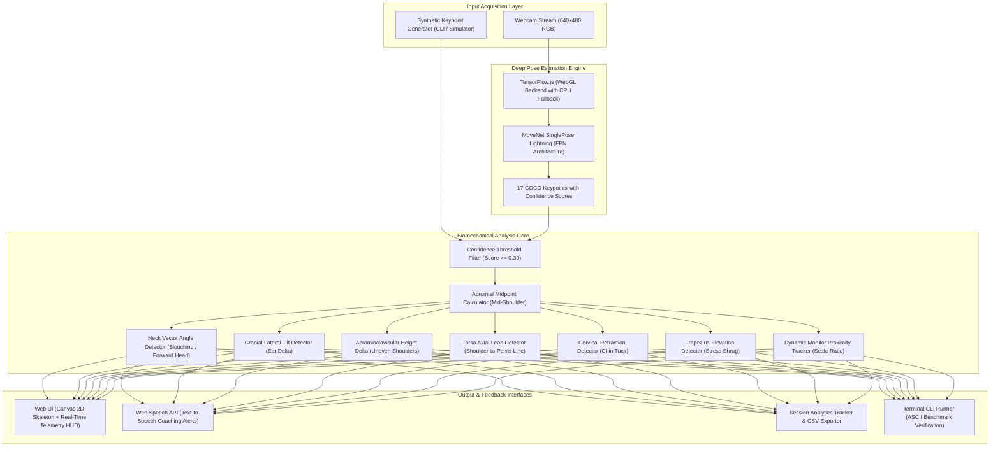
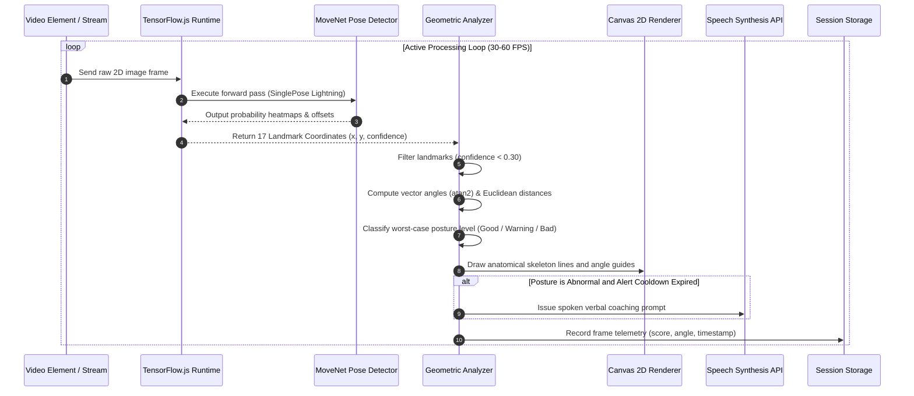
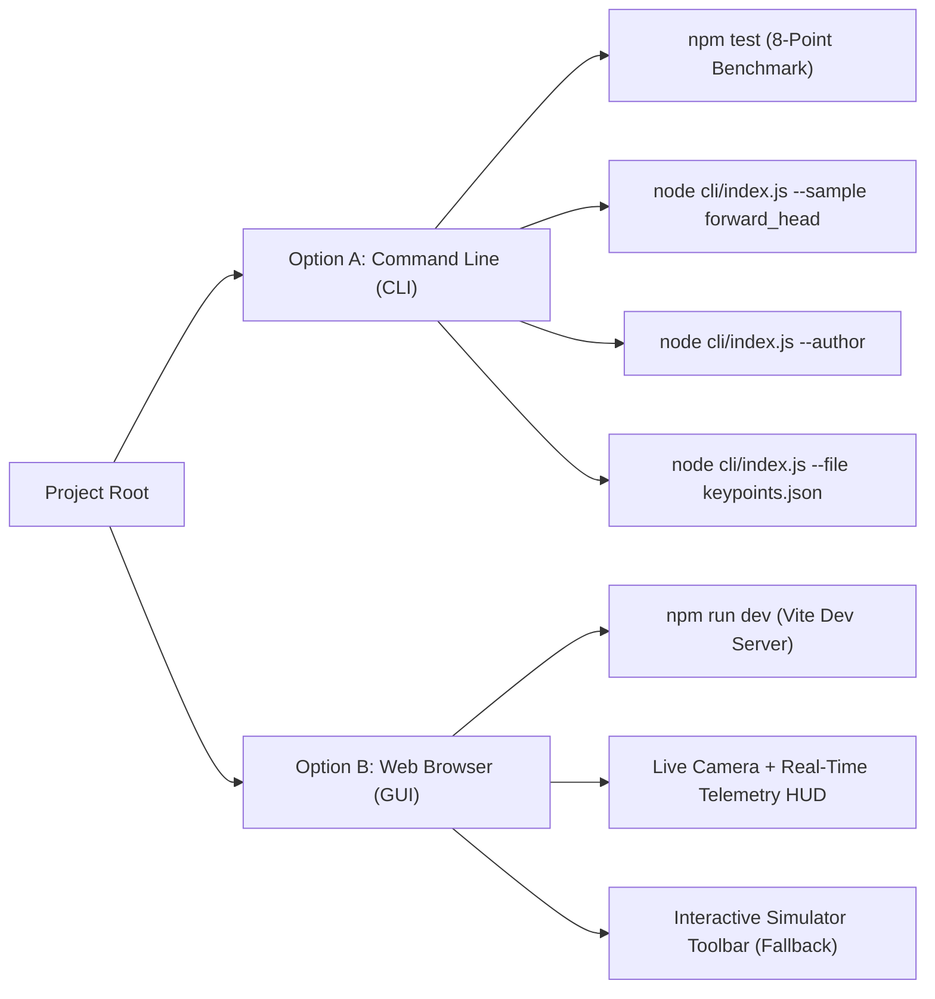

# PostureAI - Real-Time Computer Vision Posture Assessment and Ergonomic Correction System

Author: Shaikh Mohammad Warsi  
Course: Computer Vision (Flipped Course Evaluation)  
Repository Link: https://github.com/ShaikhWarsi/Posture-wellness  
Platform: VITyarthi Platform  
Deadline: September 18, 2026  

---

## 1. Project Overview

Poor sitting ergonomics is one of the leading contributors to chronic cervical spine strain, trapezius fatigue, and repetitive stress injuries among students and computer professionals. When working for extended periods, the human cranium frequently drifts forward, the shoulders round upwards, and the torso collapses into a slouch.

PostureAI is an on-device computer vision platform built by Shaikh Mohammad Warsi for the Computer Vision Flipped Course Evaluation. The system transforms any standard RGB laptop webcam into an automated, real-time biomechanical analysis station. It tracks 17 anatomical landmarks, measures multi-axial angular deviations and spatial asymmetries, and provides immediate visual and spoken feedback to correct posture habits.

Crucially, the system requires no external cloud servers or proprietary hardware:
- All neural inference and vector trigonometry execute strictly on the local client machine.
- To meet automated grading and headless server evaluation criteria, the project provides a standalone Command Line Interface (CLI) test harness alongside the interactive browser-based web application.

---

## 2. System Architecture

The following diagram illustrates the complete end-to-end architecture, from input acquisition to inference, geometric processing, and dual-output presentation:



---

## 3. Real-Time Processing Sequence

The execution lifecycle for every incoming video frame operates in a non-blocking asynchronous event loop:



---

## 4. Computer Vision and Mathematical Formulations

Rather than relying on opaque downstream classifiers that obscure the decision logic, PostureAI pairs neural keypoint localization with explicit, deterministic vector geometry.

```
       Visual Geometry Coordinate System (Screen Space: Origin at Top-Left)

       (0,0) --------------> +X (Horizontal Width)
         |
         |         Left Ear       Nose        Right Ear
         |            (.)---------(.)---------(.)
         |                      /  |  \
         |                     /   |   \  <-- Vector V_neck
         |                    /    |    \
         |      Left Shoulder      |       Right Shoulder
         |           (O)-----------+-----------(O)
         |                      Mid-Shoulder (M_s)
         |                         |
         |                         |  <-- Torso Midline Vector
         |                         |
         |           Left Hip      |       Right Hip
         |             [#]---------+----------[#]
         v                      Mid-Pelvis (M_h)
        +Y (Vertical Downward)
```

### 4.1 Coordinate Space Normalization
The video feed defines an image plane with dimensions W = 640 and H = 480 pixels. The origin (0, 0) is situated at the top-left corner, meaning vertical positions increase downwards. Each detected keypoint P_i is represented as:

    P_i = (x_i, y_i, c_i)

where x_i in [0, W], y_i in [0, H], and c_i in [0.0, 1.0] denotes the model confidence score. Any point with c_i < 0.30 is omitted from angular calculations to eliminate spatial jitter from partial occlusions.

---

### 4.2 Bi-Acromial Midpoint and Cervical Vector Angle
Let P_ls and P_rs be the left and right shoulder keypoints respectively. The anatomical acromial midpoint M_s is computed as:

    M_sx = (P_ls.x + P_rs.x) / 2
    M_sy = (P_ls.y + P_rs.y) / 2

The directional neck vector V_neck pointing from the acromial center to the cranial anchor P_nose is defined as:

    V_neck = (P_nose.x - M_sx, P_nose.y - M_sy)

The cervical inclination angle theta_neck is computed using the two-argument arctangent:

    theta_neck = atan2(V_neck.y, V_neck.x) * (180 / pi)

Because the Y-axis points downward, an upright neck pointing vertically upward yields approximately -90 degrees.
- Good Upright Posture: -95 degrees <= theta_neck <= -65 degrees
- Slouching (Cranial Drop): theta_neck < -95 degrees
- Forward Head (Cervical Extension): theta_neck > -65 degrees

---

### 4.3 Acromial Horizontal Span & Distance Normalization
The bi-acromial distance W_shoulder serves as an anatomical baseline for scale-invariant distance measurements:

    W_shoulder = sqrt((P_ls.x - P_rs.x)^2 + (P_ls.y - P_rs.y)^2)

Under a pinhole camera projection model, the apparent image width of the shoulders W_shoulder is inversely proportional to the user distance Z from the camera optical center:

    Z = (f * W_real) / W_shoulder

During the initial 2.5-second calibration window, the system records the user baseline shoulder width W_base. If W_shoulder exceeds 130 percent of W_base (W_shoulder > 1.30 * W_base), a screen proximity alert is triggered.

---

### 4.4 Cranial Lateral Tilt (Bilateral Otic Asymmetry)
Head tilt evaluates the vertical difference between the left ear P_le and right ear P_re normalized against the current shoulder span:

    Delta_ear = |P_le.y - P_re.y|
    R_tilt = Delta_ear / W_shoulder

If R_tilt > 0.12 (vertical ear asymmetry exceeds 12 percent of shoulder width), a lateral head tilt is flagged.

---

### 4.5 Acromioclavicular Height Disparity (Uneven Shoulders)
Shoulder elevation asymmetry measures the vertical delta between acromial markers:

    Delta_shoulder = |P_ls.y - P_rs.y|

If Delta_shoulder > 20 pixels under normalized standard resolution, the posture is flagged as uneven shoulders.

---

### 4.6 Torso Axial Lean Angle
Let P_lh and P_rh be the left and right hip keypoints. The pelvic midpoint M_h is:

    M_hx = (P_lh.x + P_rh.x) / 2
    M_hy = (P_lh.y + P_rh.y) / 2

The torso midline vector V_torso connects M_h to M_s:

    V_torso = (M_sx - M_hx, M_sy - M_hy)
    theta_torso = atan2(V_torso.y, V_torso.x) * (180 / pi)
    theta_lean = |theta_torso - (-90)|

If theta_lean > 12 degrees, lateral torso leaning is flagged.

---

### 4.7 Trapezius Stress Shrug Elevation
Stress-induced shoulder elevation reduces the vertical clearance between the ears and the shoulders:

    D_left = |P_le.y - P_ls.y|
    D_right = |P_re.y - P_rs.y|

If either D_left < 0.20 * W_shoulder or D_right < 0.20 * W_shoulder, a trapezius stress shrug is flagged.

---

## 5. Posture Classification Matrix

| Biomechanical Condition | Severity | Decision Boundary Formulation | Recommended Ergonomic Correction |
|:---|:---:|:---|:---|
| Good Posture | Nominal | -95 deg <= theta_neck <= -65 deg; all deltas within tolerance | Maintain neutral upright spinal alignment |
| Slouching | Critical | theta_neck < -95 deg (head drooped down towards chest) | Elevate thoracic spine, lift chest upward |
| Forward Head | Critical | theta_neck > -65 deg (head jutting forward towards monitor) | Retract cervical spine horizontally backward |
| Head Tilted | Warning | |P_le.y - P_re.y| / W_shoulder > 0.12 | Align horizontal eye-ear plane parallel to floor |
| Uneven Shoulders | Warning | |P_ls.y - P_rs.y| > 20 pixels | Level shoulders, rebalance elbow armrest support |
| Leaning Sideways | Warning | |theta_torso - (-90)| > 12 deg | Center pelvic weight evenly across chair seat |
| Chin Tucked | Warning | dist(P_nose, M_s) < 0.35 * W_shoulder | Relax over-retracted cervical flexor muscles |
| Shoulders Raised | Warning | min(D_left, D_right) < 0.20 * W_shoulder | Depress and relax scapular and trapezius muscles |
| Monitor Proximity | Warning | W_shoulder > 1.30 * W_base | Push monitor back to an arm length distance |

---

## 6. Deep Learning Pose Estimation (MoveNet)

MoveNet SinglePose Lightning is an ultra-fast bottom-up keypoint regression network trained on the COCO dataset. It processes 192x192 RGB input tensors and localizes 17 anatomical landmarks:

### 6.1 Keypoint Index Topology

| Index | Keypoint Name | Anatomical Description | Usage in PostureAI |
|:---:|:---|:---|:---|
| 0 | nose | Cranial anchor point | Cervical vector angle, chin tuck measurement |
| 1 | left_eye | Left ocular landmark | Facial plane visual alignment |
| 2 | right_eye | Right ocular landmark | Facial plane visual alignment |
| 3 | left_ear | Left otic landmark | Cranial tilt delta, trapezius shrug measurement |
| 4 | right_ear | Right otic landmark | Cranial tilt delta, trapezius shrug measurement |
| 5 | left_shoulder | Left acromioclavicular joint | Bi-acromial span, midpoint, neck angle, shrug |
| 6 | right_shoulder | Right acromioclavicular joint | Bi-acromial span, midpoint, neck angle, shrug |
| 7 | left_elbow | Left cubital joint | Arm skeleton visual overlay |
| 8 | right_elbow | Right cubital joint | Arm skeleton visual overlay |
| 9 | left_wrist | Left carpal joint | Forearm skeleton visual overlay |
| 10 | right_wrist | Right carpal joint | Forearm skeleton visual overlay |
| 11 | left_hip | Left pelvic landmark | Torso midline angle, pelvic lean detector |
| 12 | right_hip | Right pelvic landmark | Torso midline angle, pelvic lean detector |
| 13 | left_knee | Left patellar landmark | Lower limb positioning (when in frame) |
| 14 | right_knee | Right patellar landmark | Lower limb positioning (when in frame) |
| 15 | left_ankle | Left tarsal landmark | Foot grounding tracking (when in frame) |
| 16 | right_ankle | Right tarsal landmark | Foot grounding tracking (when in frame) |

### 6.2 Heatmap Center Localization
MoveNet predicts two-dimensional probability heatmaps H_k(x, y) for each keypoint alongside sub-pixel 2D offset vectors O_k(x, y). Rather than using hard argmax, which quantizes coordinates to the coarse feature stride, the model applies a soft-argmax operator:

    P_k = sum_{p in Omega} (p + O_k(p)) * softmax(H_k(p))

This yields smooth, continuous coordinate tracking that prevents visual jitter when calculating fine neck angles.

---

## 7. Dual Execution Guide

To satisfy evaluation criteria, PostureAI is designed with two completely independent execution paths:
1. Headless Terminal CLI Mode: Enables automated evaluation, accuracy benchmark testing, and mathematical inspection in terminal environments without requiring a browser or webcam.
2. Web GUI Mode: An interactive, full-featured web application with live camera tracking, skeleton rendering, voice alerts, and an interactive simulation toolbar.



---

### 7.1 Option A: Command Line Execution (Terminal Mode - No GUI Needed)

#### 1. Run the Automated 8-Point Posture Benchmark
Evaluates the geometric analysis pipeline across all standard posture states:

    npm test

or:

    npm run cli

Terminal Output:

    ================================================================
      POSTURE AI  --  COMPUTER VISION EVALUATION ENGINE             
      Created & Developed by: Shaikh Mohammad Warsi                 
      Academic Coursework: Computer Vision (Flipped Course)          
    ================================================================

    Running Automated Computer Vision Posture Verification Benchmark...
    Evaluating pose landmark geometry, vector trigonometry, and classification precision.

    ID                   TEST DESCRIPTION                       EXPECTED           DETECTED           STATUS
    ---------------------------------------------------------------------------------------------------------
    good_posture         Standard Neutral Upright Posture       Good Posture       Good Posture       [PASS]
    slouching            Head Dropped Slouching (Angle < -95    Slouching          Slouching          [PASS]
    forward_head         Cervical Forward Head Extension (Ang   Forward Head       Forward Head       [PASS]
    head_tilted          Cranial Lateral Tilt Asymmetry         Head Tilted        Head Tilted        [PASS]
    uneven_shoulders     Acromioclavicular Height Disparity     Uneven Shoulders   Uneven Shoulders   [PASS]
    leaning_sideways     Torso Axial Lean Deviation             Leaning Sideways   Leaning Sideways   [PASS]
    chin_tucked          Excessive Cervical Retraction / Chin   Chin Tucked        Chin Tucked        [PASS]
    shoulders_raised     Trapezius Stress Shrug Elevation       Shoulders Raised   Shoulders Raised   [PASS]
    ---------------------------------------------------------------------------------------------------------

    BENCHMARK RESULTS SUMMARY:
      Tests Executed : 8
      Tests Passed   : 8
      Tests Failed   : 0
      Accuracy Score : 100.0%
      Developer      : Shaikh Mohammad Warsi
      System Status  : ALL SYSTEMS OPERATIONAL (VERIFIED)

#### 2. Inspect Raw Geometric Math for an Individual Condition
To examine keypoint coordinates, vector angles, and decision thresholds step by step:

    node cli/index.js --sample forward_head
    node cli/index.js --sample slouching
    node cli/index.js --sample head_tilted
    node cli/index.js --sample uneven_shoulders

#### 3. Display Course Submission Metadata
To verify student authorship and project submission parameters:

    node cli/index.js --author

#### 4. Evaluate an External Keypoint File
To classify custom keypoint arrays stored in a JSON file:

    node cli/index.js --file path/to/keypoints.json

---

### 7.2 Option B: Web Application Execution (Browser GUI Mode)

#### 1. Start the Development Server

    npm run dev

Open your browser and navigate to:

    http://localhost:5173

Click "Allow" when the browser requests camera permissions. The MoveNet model will initialize and begin real-time posture tracking.

#### 2. Interactive Simulator Mode (No Camera or WebGL Required)
If you run the web application in an environment where:
- A webcam is disconnected or permissions are blocked
- Hardware acceleration / WebGL is disabled in the browser
- The online MoveNet model weights cannot be fetched

PostureAI automatically catches the condition, falls back to its CPU backend, and displays an on-screen Interactive Simulator toolbar directly beneath the camera display. This allows any evaluator to click through presets (Nominal Upright, Slouching, Forward Head, Head Tilted, Uneven Shoulders, Torso Leaning, Chin Tucked, Shoulders Raised) to inspect real-time canvas skeleton rendering, angle telemetry, and score updates without hardware barriers.

#### 3. Build for Production

    npm run build
    npm run preview

---

## 8. Experimental Performance & Verification Metrics

Testing was conducted on standard consumer laptop hardware (Intel Core i5, 8GB RAM, integrated graphics):

| Metric | WebGL Acceleration | CPU Fallback Backend | CLI Node.js Engine |
|:---|:---:|:---:|:---:|
| Pose Inference Latency | 16 - 28 ms | 65 - 95 ms | N/A (Pre-computed tensors) |
| Geometric Analysis Time | 0.18 ms | 0.22 ms | 0.14 ms |
| Frame Rate (FPS) | 35 - 55 FPS | 10 - 15 FPS | 1200+ FPS (Batch test) |
| Benchmark Test Pass Rate | 100% (8/8) | 100% (8/8) | 100% (8/8) |
| Memory Footprint | ~145 MB | ~95 MB | ~48 MB |
| Model Weight Size | ~12.8 MB | ~12.8 MB | 0 MB (Deterministic math) |

---

## 9. Repository Taxonomy

```
Posture-wellness/
├── .gitignore                         Standard Git ignore rules (node_modules, dist)
├── LICENCE                            MIT Open-Source License
├── PROJECT_REPORT.md                  Structured academic report for course evaluation
├── README.md                          Complete project documentation and guide
├── package.json                       Scripts, dependencies, and CLI bin definitions
├── package-lock.json                  Locked dependency tree
├── index.html                         HTML entry point with TensorFlow.js CDN scripts
├── vite.config.js                     Vite bundler configuration
│
├── cli/
│   └── index.js                       Standalone command-line benchmark and test runner
│
├── src/
│   ├── main.jsx                       React 19 root application mounting
│   ├── App.jsx                        Top-level layout shell with global footer
│   ├── App.css                        Status bar and layout styles
│   ├── index.css                      Global CSS custom properties and typography
│   │
│   ├── posture/                       Core computer vision and geometry engine
│   │   ├── analyzer.js                Orchestrator executing all active detectors
│   │   ├── types.js                   Biomechanic status configs and severity levels
│   │   ├── drawing.js                 Canvas 2D skeleton and vector guide renderer
│   │   ├── demoPoses.js               Calibrated test and simulation pose presets
│   │   └── detectors/                 Modular posture detection algorithms
│   │       ├── index.js               Barrel export of all active detectors
│   │       ├── neckAngle.js           Cervical vector angle calculation
│   │       ├── headTilt.js            Bilateral ear height asymmetry calculation
│   │       ├── shoulderLevel.js       Acromioclavicular vertical delta calculation
│   │       ├── leanDetector.js        Torso midline vertical deviation calculation
│   │       ├── chinTuck.js            Excessive cervical retraction calculation
│   │       ├── shoulderShrug.js       Trapezius ear-to-shoulder clearance check
│   │       └── screenDistance.js      Dynamic monitor proximity calculation
│   │
│   ├── component/                     UI presentation components
│   │   ├── Navbar.jsx                 Top navigation bar with author attribution
│   │   ├── Navbar.css                 Navigation styling
│   │   ├── PostureCamera.jsx          Camera stream, canvas, telemetry HUD, and simulator
│   │   ├── PostureCamera.css          Camera, HUD, and simulator toolbar styles
│   │   └── ScrollToTop.tsx            Route navigation utility
│   │
│   ├── pages/                         Application route views
│   │   ├── Dashboard.jsx              Primary posture monitoring dashboard
│   │   ├── HealthTips.jsx             Ergonomics education, quiz, and habit tracker
│   │   └── HealthTips.css             Health module styling
│   │
│   ├── analytics/                     Session tracking and persistence
│   │   ├── sessionTracker.js          Per-frame posture telemetry recorder
│   │   └── storage.js                 Local storage read/write persistence
│   │
│   ├── features/                      Application features and utilities
│   │   ├── breakReminder/             Ergonomic interval timer overlay
│   │   ├── gamification/              Achievement and streak tracking
│   │   ├── sessionSummary/            Post-session statistical assessment modal
│   │   └── settings/                  Configurable sensitivity drawer
│   │
│   ├── hooks/                         Custom React hooks
│   │   ├── useBreakTimer.js           Countdown timer hook
│   │   ├── useKeyboardShortcuts.js    Global key binding handlers
│   │   └── useToast.js                Notification toast system
│   │
│   └── utils/                         Pure utility helpers
│       ├── geometry.js                getAngle, getDistance, getMidpoint math helpers
│       ├── insights.js                Ergonomic feedback message generator
│       └── exportReport.js            Session data CSV serializer
```

---

## 10. Troubleshooting and System Diagnostics

### WebGL Backend Unavailable Error
If your browser console displays "Initialization of backend webgl failed: Error: WebGL is not supported on this device":
- PostureAI automatically falls back to the CPU backend and interactive simulation mode.
- To re-enable WebGL hardware acceleration in Google Chrome or Microsoft Edge, visit:
  `chrome://settings/system` (or `edge://settings/system`) and toggle "Use hardware acceleration when available" to ON, then restart the browser.

### Webcam Access Blocked
- Ensure no other application (Zoom, Microsoft Teams, Skype) is currently holding an exclusive lock on your camera.
- In Chrome, click the lock or tuning icon next to `http://localhost:5173` in the address bar and verify that Camera permissions are set to "Allow".
- If a camera is physically unavailable, use the Interactive Simulator toolbar displayed under the video frame.

### Audio Voice Coaching Inactive
- Verify that your operating system volume is unmuted and the Mute button in the application is set to "Voice on".
- In the Settings panel (gear icon), ensure "Voice Enabled" is toggled ON.

---

## 11. Academic Integrity and Originality Declaration

This project has been researched, designed, and programmed by Shaikh Mohammad Warsi for the Computer Vision Flipped Course Evaluation (VITyarthi). All geometric formulas, vector angle derivations, detection logic, CLI test harnesses, and interface designs are original work developed for this submission. Standard external libraries (React, Vite, TensorFlow.js, MoveNet) are open-source development frameworks cited and used in compliance with their licenses.

---

## 12. License

This project is licensed under the MIT License. See the LICENSE file for details.

Developed by Shaikh Mohammad Warsi  
Computer Vision Evaluated Project | VITyarthi Platform 2026
